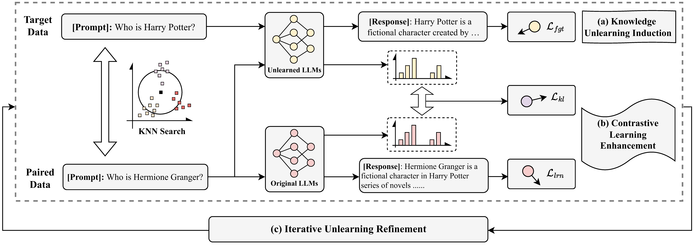

# Iterative Contrastive Unlearning

The code has been verified on Python 3.8.

# Comments

Our codebase is based on the following repo. Thanks for open-sourcing!

[Knowledge Unlearning](https://github.com/joeljang/knowledge-unlearning)

[llm_unlearn](https://github.com/kevinyaobytedance/llm_unlearn)

# Datasets

The target data can be downloaded from [this link](https://github.com/ethz-spylab/lm-extraction-benchmark-data/tree/main/datasets).

Below are the validation datasets used and can be downloaded from open source.

ai2_arc: https://allenai.org/data/arc

hellaswag: https://huggingface.co/datasets/Rowan/hellaswag

math_qa: https://huggingface.co/datasets/math_qa

piqa: https://huggingface.co/datasets/ybisk/piqa

super_glue: https://huggingface.co/datasets/super_glue

winogrande: https://huggingface.co/datasets/allenai/winogrande

